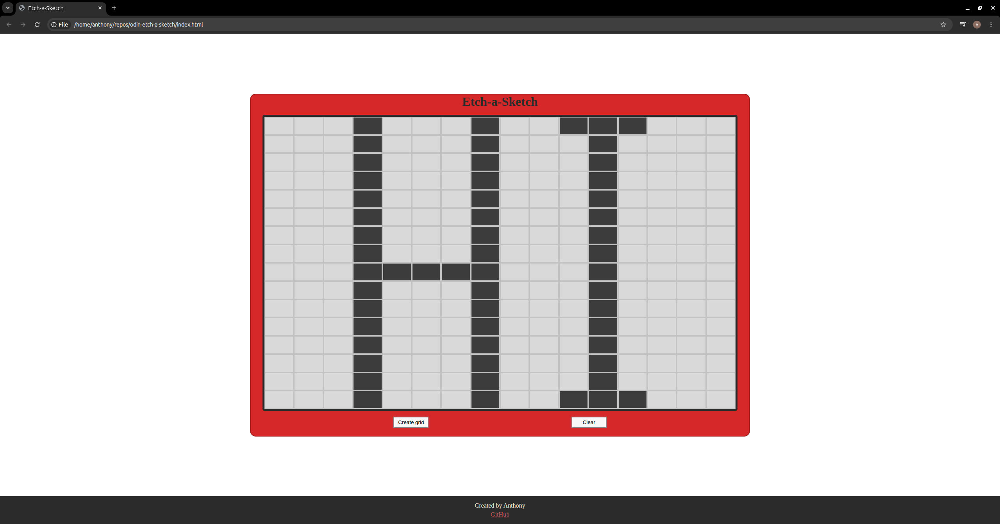

# Odin-Etch-a-Sketch

## Description
This is a browser-based recreation of the classic Etch-a-Sketch toy, built as part of The Odin Project Foundations curriculum. This project allows custom grid creation and a button to clear the entire grid of any drawing.

## Live Demo
[Try it out!](https://aeochoa99.github.io/odin-etch-a-sketch/)

## Features
- Adjustable grid size - create a custom grid up to 100x100 cells
- Hover to draw - cells darken as you move your mouse over them
- Clear button - resets the grid back to its default color without needing to recreate it

## How it works
- The grid is built dynamically with JavaScript, generating div elements sized as a percentage of the grid container based on the chosen grid size.
- A mouseover event listener on the grid container detects when the cursor enters a cell and changes its background color.
- The Create grid button prompts the user to create a grid size by entering a number between 1-100.
- The Clear button resets every cell's background color without removing the generated grid.

## Built with
- HTML5
- CSS3 (Flexbox)
- Vanilla JavaScript (DOM manipulation and event listeners)

## Running locally
1. git clone git@github.com:aeochoa99/odin-etch-a-sketch.git
2. cd odin-etch-a-sketch
3. Open index.html in your browser.

## Acknowledgments
Project brief from [The Odin Project](https://www.theodinproject.com/lessons/foundations-etch-a-sketch)